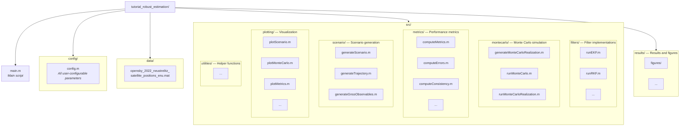

```mermaid
flowchart TD

    %% =====================================================
    %% Root
    %% =====================================================

    ROOT["tutorial_robust_estimation/"]

    MAIN["main.m<br/><i>Main script</i>"]

    ROOT --> MAIN

    %% =====================================================
    %% Config
    %% =====================================================

    subgraph CONFIG["config/"]
        CONFIG_M["config.m<br/><i>All user-configurable parameters</i>"]
    end

    ROOT --> CONFIG

    %% =====================================================
    %% Data
    %% =====================================================

    subgraph DATA["data/"]
        SAT_DATA["opensky_2022_neustrelitz_<br/>satellite_positions_enu.mat"]
    end

    ROOT --> DATA

    %% =====================================================
    %% Source
    %% =====================================================

    subgraph SRC["src/"]

        direction TB

        %% Filters
        subgraph FILTERS["filters/ — Filter implementations"]
            EKF["runEKF.m"]
            RKF["runRKF.m"]
            FILTER_MORE["..."]
        end

        %% Monte Carlo
        subgraph MC["montecarlo/ — Monte Carlo simulation"]
            MC_GEN["generateMonteCarloRealization.m"]
            MC_RUN["runMonteCarlo.m"]
            MC_REAL["runMonteCarloRealization.m"]
        end

        %% Metrics
        subgraph METRICS["metrics/ — Performance metrics"]
            METRICS_MAIN["computeMetrics.m"]
            ERRORS["computeErrors.m"]
            CONSISTENCY["computeConsistency.m"]
            METRICS_MORE["..."]
        end

        %% Scenario
        subgraph SCENARIO["scenario/ — Scenario generation"]
            SCENARIO_MAIN["generateScenario.m"]
            TRAJECTORY["generateTrajectory.m"]
            GNSS["generateGnssObservables.m"]
        end

        %% Plotting
        subgraph PLOTTING["plotting/ — Visualization"]
            PLOT_SCENARIO["plotScenario.m"]
            PLOT_MC["plotMonteCarlo.m"]
            PLOT_METRICS["plotMetrics.m"]
            PLOT_MORE["..."]
        end

        %% Utilities
        subgraph UTILITIES["utilities/ — Helper functions"]
            UTIL_MORE["..."]
        end

    end

    ROOT --> SRC

    %% =====================================================
    %% Results
    %% =====================================================

    subgraph RESULTS["results/ — Results and figures"]
        FIGURES["figures/"]
        RESULTS_MORE["..."]
    end

    ROOT --> RESULTS
```
