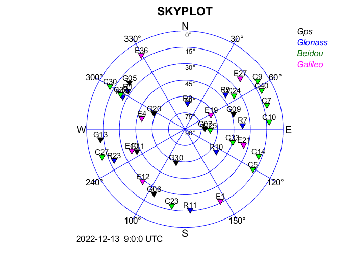
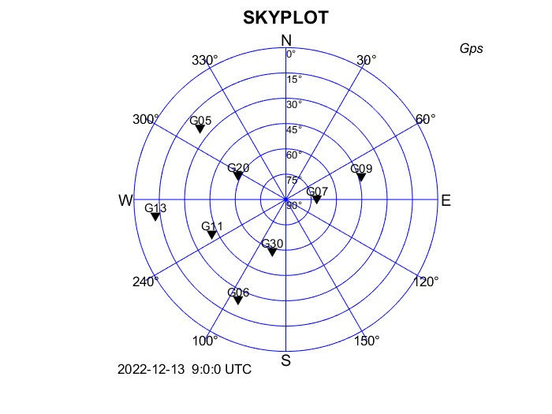
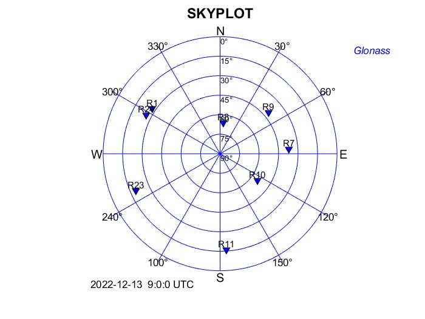
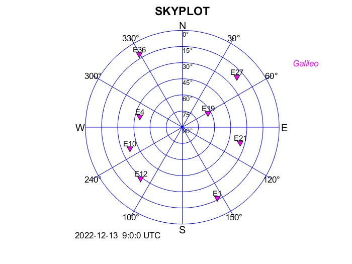
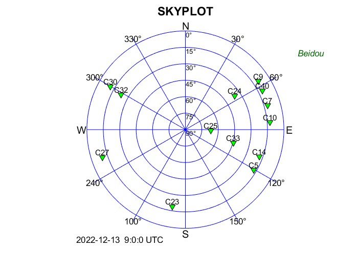
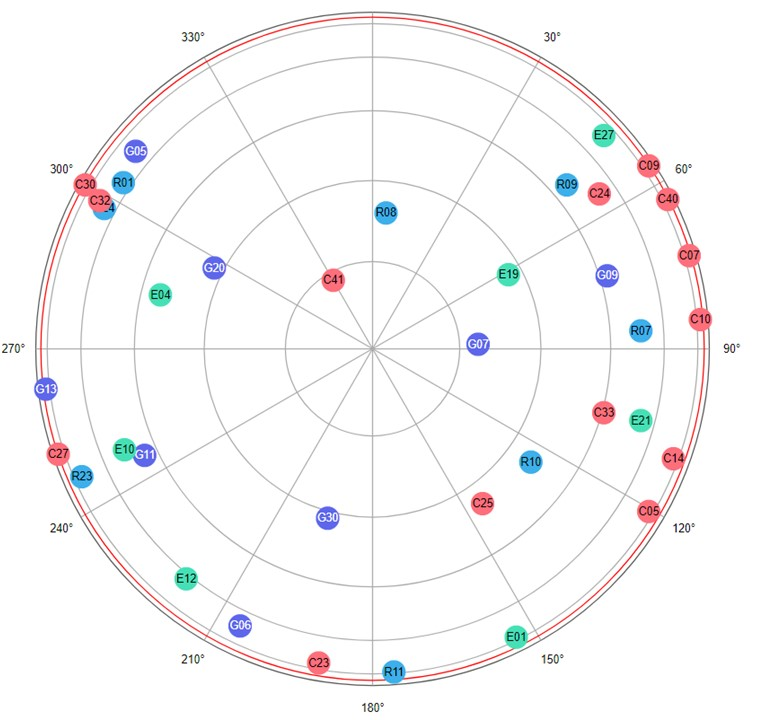

# MULTI GNSS SIMULATION TOOL

## Description


The tool provides a Matlab framework to perform the analysis of position dilution of precision (PDOP) of global navigation satellite stystems (GNSSs). In first place, the tool computes the satellite orbits starting from standard broadcasted nav data given in brdc rinex file. Afterwards, it is possible to evaluate the PDOP with different systems in a specific location and time simulating open-sky condition or urban environment. The following list presents some of the key features of the tool:
- Broadcased ephemeris rinex reader
- GNSS orbits computation
- PDOP analysy in open-sky and simple urban environment (single road with walls)
- Skyplots

## Installation
Clone the repository on your machine. No additional external dependencies are needed.
### Requirements
Only Matlab is required. This software was tested with the verison 2022a.

## Validation
The software has been validate with the help of [GNSS mission planning](http://gnssmissionplanning.com/). The same location, time and cut-off elevation angle of 10 deg has been used to reproduce the results. In the skyplots below it can be seen that for GPS and Glonass there is a perfect match of the visible satellites. In the case of Galileo, the software shows one more satellite, the E36. Concerning Beidu, the satellite C40 is missing whereas the satellite C25 is mislocated. The reasons of these problems has not been yet identified. Nevertheless, inconsistent skyplot have been observed when using the [Trimble planning tool](https://www.gnssplanning.com/#/settings), also with respect to the GNSS mission planning tool.

| System   | Skyplot  |  
|----------|----------|
| GPS      |   |
| Glonass  |   |
| Galileo  |   |
| Beidu    |   |
| GNSS Mission Planning |  |

## Usage
The tool is based on an easy-to-use configuration file **cfg_main.m** located in the directory *config*. After setting the parameters and variables, open and run the main script file **Multi_GNSS_Simualtion_Tool.m**. To correctly run the main script a brdc rinex file must be located in the directory *input\brdc_rinex*. Running the main will generate two main data files in the directory *input*, the matrix containing the ephemeris extracted form the rinex named **eph.mat** and the raw orbits computed called **satRawPos.mat**. Additionally in the directory *output* the visible satellites data structure will be saved, namely **satVisPos.mat**. This data can be used for further processing. New scripts must saved and located in the folder *scripts*. The *docs* folder contains a HTML guideline automatically generated with [M2HTML](https://github.com/gllmflndn/m2html). In case of moodification provide the new docs with the commited changes.

### Configuration file
An example of configuration file is given in the folder *examples*.
```
% CONFIGURATION FILE
%
% This is a configuration file for the main script
% MULTI_GNSS_Simulation_tool. It allows to set all the variables and
% parameters to perform the simulation.


Insert_data=[2022 12 13 9 0 0];     % Insert initial simulation [year month day hour minutes seconds]
el_mask=10;                         % [Deg]
location=[45.067828,7.690724,239];  % [Lat Long_est h] 
download_last_rinex = 0;            % Download last available rinex of the day
in_path = 'BRDM00DLR_S_20223470000_01D_MN.rnx';     %Insert the name of the rinex file
Costellation=[1,1,1,1];             % [GPS,GLonass,Beidou,Galileo] chose 1 to activate system
simulation_time=2;                  % [hour]
step_sim=30;                        % [sec]

%% PDOP Simulation
enable_pdop = 1;            % Enable PDOP analysis

%% Skyplot Input
enable_skyplot = 1;         % Enable skyplot 1=True, 0=False
Skyplot_time=[0];         % To plot a specific time instant insert the number of hours after the strart time. For an interval insert a vector of hours like [0,2]
Skyplot_costellation=5;     % 1=GPS 2=GLONASS 3=BEIDOU 4=GALILEO 5=Multi Costellation
skyplot_downsample = 20;    % Downsample skyplot plotting [s] 

%% Input for Urban Environment simulation
enable_urban_sim = 1;       % Enable urban simulation 1=True, 0=False
enable_urban_skyplot=1;     % Enable skyplot 1=True, 0=False
dir_az=312;                 % [Deg] direction of road 0°=N
width=8;                    % Width of the road  [m] 
height=12;                  % Height of building [m]

%% Loading the input
load_eph = 1;           % Load the ephemeris if already exist (after first run). If 0 the rinex file will be used.
                        % Thei can be find in "input\eph.mat"
%% Save output
save_raw_orbits = 1;    % Save the computed position for the full set of satellites. It can be find in "input\satRawPos.m"
save_vis_orbits = 1;    % Save the visible satellites position. It can be fin in "output\satVisPos.m"
load_raw_orbits = 0;    % Load raw orbits for all satellites (available after saving raw_orbits)
load_vis_orbits = 0;    % Load visible satellites (available after saveing vis_orbits)
```

### Using the output data struct
The output **satVisPos.mat** is a struct containing all the relevant information about the open sky scenario. Accessing the data is straightforward, as explained in the following
```
struc(k).system.variables
```
1. struct = name of the matlab struct
2. k = array index value
3. system = GNSS constellation. The options are GPS, GAL, BEI, GLO respectively for GPS, Galileo, Beidu, Glonass.
4. variables = set of data available which are:
    - abs_xyz = absolute position of the satellites in ECEF
    - xyz = dx, dy, dz of the satellite with respect to the considerd point of interest
    - el = satellites elevation
    - az = satellites azimuth
    - PRN = satellites code
    - time = time of the day in seconds
    - date = startingtime of the simulation [YYYY MM DD hh mm ss]
    - PDOP = position dilution of precision
    - H = geometry matrix
